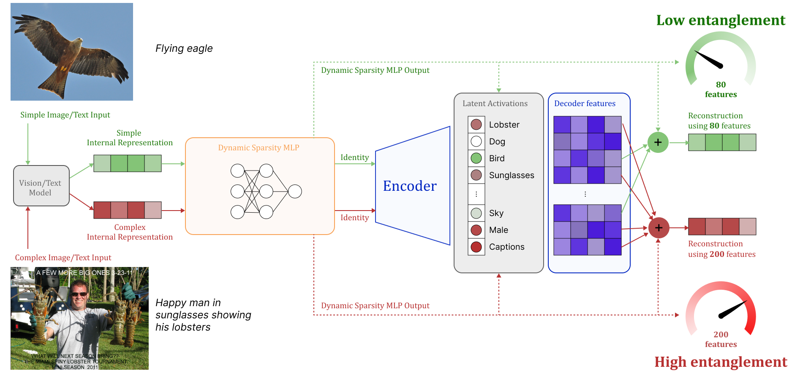

<div align="center">

# SoftSAE
### Dynamic Top-K Selection for Adaptive Sparse Autoencoders

<br>

<!-- Replace the path below with your teaser image -->


<br><br>

</div>

This repository contains the implementation of SoftSAE, a sparse autoencoder with a dynamic Top-K selection mechanism designed for mechanistic interpretability. The method adapts the number of active features per input, enabling more faithful representations of data with varying intrinsic complexity.

## How to run

### Initial setup
Create conda environment (or mimic a configuration inside your preferred tool):

```bash
conda create --prefix ./env python=3.11
conda activate ./env
conda install nvidia/label/cuda-12.8.0::cuda-toolkit -c nvidia
```

Install packages:
```bash
pip install ./lapsum/
pip install ./dictionary_learning/
pip install ./SAEBench/
```

### CLIP
To work with CLIP models you'll need a precomputed activations from clip in .npy format. We recommend using a working `precompute_activations.py` script from [CLIP Matryoshka](https://github.com/WolodjaZ/MSAE) paper

With `.npy` files ready you can train and evaluate your SoftSAE like this:
```bash
python soft_sae_clip/clip_train_eval.py -a SoftSAE -dt <training_data_npy> -dv <validation_data_npy> -c soft_sae_clip/configs/SoftSAE_220.json
```
example configs are placed in `soft_sae_clip/configs`

### LLM
To train SAE on LLM activations use `soft_sae_llm/demo.py`, to customize configuration please look at `soft_sae_llm/demo_config.py`

Example command to train SoftSAE:
```bash
python soft_sae_llm/demo.py --save_dir run_name --model_name google/gemma-2-2b --layers 12 --architectures soft_sae
```

Scripts inside `softsae_saebench` allow to evaluate your trained LLM SAE against SAEBench tasks. Inside `softsae_saebench/sae_list.py` you'll have to provide a list of SAEs you want to evaluate by specifying path to pretrained weights and the correct SAE class. **Please for SoftSAE use SoftSAEPatched class**. With correctly prepared sae_list you can run a benchmark:

**Core**
```bash
python softsae_saebench/run_core.py
```


**Absorption/Splitting**
```bash
python softsae_saebench/absorption.py
```

**SCR/TPP**
```bash
python softsae_saebench/.py
```